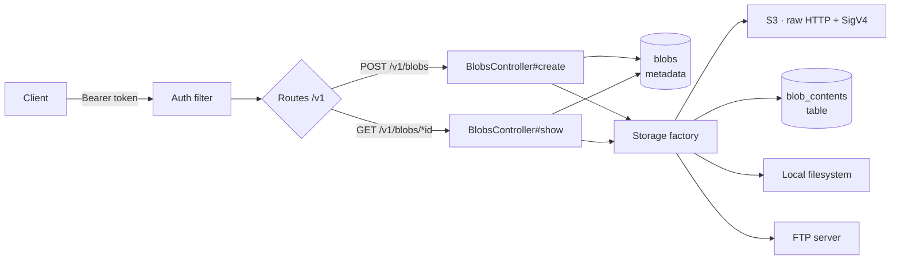
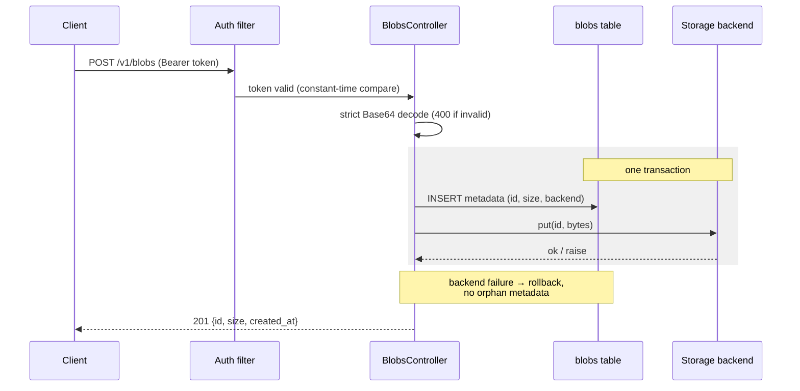
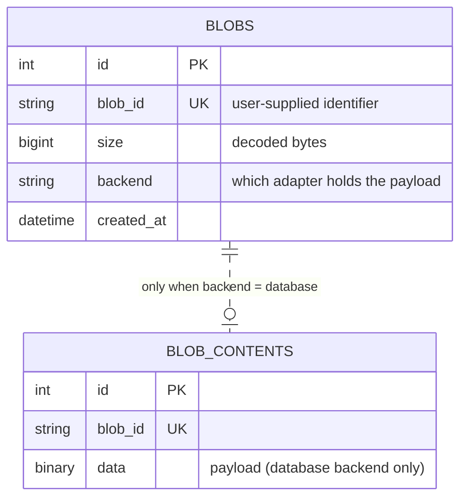
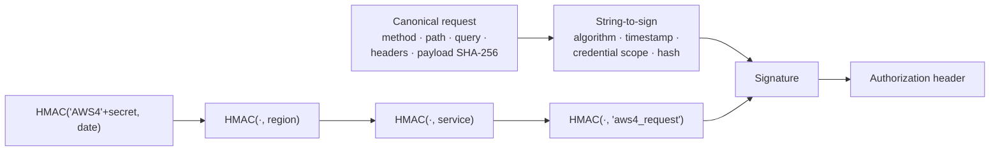

# Simple Drive

[](https://github.com/AbdulAlharbi/simple-drive/actions/workflows/ci.yml)


A Ruby on Rails API that stores and retrieves blobs of data through a single
interface backed by one of four interchangeable storage backends:
**S3-compatible object storage**, a **database table**, the **local file
system**, or an **FTP server**.

The S3 backend speaks the S3 REST protocol directly over `Net::HTTP` with a
from-scratch implementation of **AWS Signature Version 4** — no S3 or AWS
libraries are used anywhere in the project.



## Requirements → design decisions

Every requirement from the brief, the decision made for it, the reasoning,
and where to verify it — both the implementation and the test that proves it.

| Requirement | Design decision | Why | Proof |
|---|---|---|---|
| Single interface over multiple backends | Adapter pattern: `put(id, bytes)` / `get(id)` contract on `Storage::BaseBackend`, resolved by a config-driven factory | Controllers never know which backend is active; adding a backend touches one class + one factory entry | `app/services/storage.rb` · every backend test |
| S3-compatible backend, **no S3 libraries** | S3 REST protocol over plain `Net::HTTP`, authenticated by a hand-written SigV4 signer | The brief makes this the core challenge; the signer is validated against AWS's officially documented example signature, byte-for-byte | `app/services/storage/sig_v4.rb` · `test/services/sig_v4_test.rb` |
| Database backend in a separate table | Dedicated `blob_contents` table with its own model, never touching the tracking table | Hot metadata stays small and fast; payload lifecycle decoupled from metadata lifecycle | `db/migrate/*_create_blob_contents.rb` · `test/services/database_backend_test.rb` |
| Local backend, single path config | Files named by SHA-256 of the id, sharded two levels, written via temp-file + atomic rename | User input never touches the filesystem as a path — ids like `../../etc/passwd` cannot escape the root; readers never see partial writes | `app/services/storage/local_backend.rb` · traversal test in `test/services/local_backend_test.rb` |
| FTP backend (bonus) | stdlib `net/ftp` with an injectable connection factory | Dependency injection lets the unit tests drive it without a live server | `app/services/storage/ftp_backend.rb` · `test/services/ftp_backend_test.rb` |
| Tracking table: metadata only | `blobs` records id, size, timestamps **and which backend holds the payload**; metadata insert + backend write share one transaction | Per-blob backend routing means reconfiguring the service never strands old data; rollback guarantees no orphan metadata if a backend write fails | `app/models/blob.rb` · rollback test in `test/controllers/v1/blobs_controller_test.rb` |
| Ids may be UUIDs, paths, arbitrary strings | Wildcard route (`*id`, `format: false`); ids treated as opaque everywhere | Slashes and dots survive routing intact; no backend ever interprets id semantics | `config/routes.rb` · path-id test in controller tests |
| Reject undecodable Base64 | `Base64.strict_decode64` — canonical Base64 only | Loose decoding silently accepts corrupted input; strict decoding rejects bad alphabet, bad padding, stray whitespace with `400` | `app/controllers/v1/blobs_controller.rb` · invalid-Base64 test |
| Bearer auth on every request | `before_action` on the base controller; constant-time comparison via `secure_compare` | No endpoint can forget auth; constant-time compare closes the timing side channel on token guessing | `app/controllers/application_controller.rb` · 401 tests |
| Unit + integration tests (bonus) | 34 tests / 72 assertions across both layers; S3 tested over real HTTP against an in-process fake server | Wire-level testing matches the project's core claim: it speaks real HTTP to S3 | `test/` · CI on every push |

## Quick start (macOS / Linux)

Requires Ruby 3.1+ (`.ruby-version` targets 3.3; on macOS:
`brew install rbenv ruby-build && rbenv install` inside the repo).

```sh
bundle install
bin/rails db:prepare

export SIMPLE_DRIVE_TOKEN=$(openssl rand -hex 32)
export STORAGE_BACKEND=local        # local | database | s3 | ftp

bin/rails server
```

Run the test suite:

```sh
bin/rails test
```

## Quick start (Docker, with a real S3 server)

```sh
docker compose up --build
```

Starts three services: the API on port 3000, a real S3-compatible server
([minio](https://min.io)), and a one-shot job that creates the bucket before
the app boots. Token is `dev-token`. The minio console at
http://localhost:9001 (`minioadmin` / `minioadmin`) lets you watch objects —
stored by the hand-rolled SigV4 client — land in the bucket.

## Configuration

Everything is environment-driven; `.env.example` documents every variable.

| Variable | Purpose |
|---|---|
| `SIMPLE_DRIVE_TOKEN` | Bearer token accepted by the API (required) |
| `STORAGE_BACKEND` | `local` (default) \| `database` \| `s3` \| `ftp` |
| `LOCAL_STORAGE_PATH` | Root directory for the local backend |
| `S3_ENDPOINT`, `S3_BUCKET`, `S3_REGION`, `S3_ACCESS_KEY_ID`, `S3_SECRET_ACCESS_KEY` | S3-compatible backend (AWS S3, minio, DO Spaces, Linode) |
| `FTP_HOST`, `FTP_PORT`, `FTP_USER`, `FTP_PASSWORD`, `FTP_BASE_DIR`, `FTP_PASSIVE` | FTP backend |

## API

All requests require Bearer authentication; anything else receives `401`.

```
Authorization: Bearer <SIMPLE_DRIVE_TOKEN>
```

### Store a blob — `POST /v1/blobs`

```sh
curl -X POST http://localhost:3000/v1/blobs \
  -H "Authorization: Bearer $SIMPLE_DRIVE_TOKEN" \
  -H "Content-Type: application/json" \
  -d '{"id": "docs/hello.txt", "data": "SGVsbG8gU2ltcGxlIFN0b3JhZ2UgV29ybGQh"}'
```

`201 Created`:

```json
{ "id": "docs/hello.txt", "size": "27", "created_at": "2026-08-06T11:18:23Z" }
```

What happens inside — note the transaction boundary:



- `id` is opaque and unique — any string works, including path-like ids.
- Invalid Base64 → `400`. Duplicate id → `409`. Missing fields → `400`.

### Retrieve a blob — `GET /v1/blobs/:id`

```sh
curl http://localhost:3000/v1/blobs/docs/hello.txt \
  -H "Authorization: Bearer $SIMPLE_DRIVE_TOKEN"
```

`200 OK`:

```json
{
  "id": "docs/hello.txt",
  "data": "SGVsbG8gU2ltcGxlIFN0b3JhZ2UgV29ybGQh",
  "size": "27",
  "created_at": "2026-08-06T11:18:23Z"
}
```

`size` is the decoded size in bytes; `created_at` is UTC ISO 8601. Unknown
ids receive `404`. Retrieval routes to **the backend recorded on the blob's
metadata**, not the currently configured one — so blobs stored before a
backend reconfiguration remain retrievable.

## Architecture

### Data model

Strict separation between tracking metadata and payload storage — the
tracking table never holds data, and the database *backend* uses its own
table:



Uniqueness is enforced twice on purpose: an application-level check gives
the friendly `409` fast path, and a database unique index is the real
guarantee under concurrency.

### Storage abstraction

Every backend implements a two-method interface:

```ruby
put(id, bytes)   # persist raw bytes under the opaque identifier
get(id)          # return raw bytes, or raise Storage::NotFound
```

`Storage.backend(name)` resolves the configured backend through a factory.
Backends raise a shared error hierarchy (`Storage::Error`,
`Storage::NotFound`, `Storage::ConfigurationError`) which the base
controller maps to HTTP (`502` / `404` / `500`) in one place — no backend
detail leaks upward.

### The SigV4 signer

The brief forbids S3 libraries, so request signing is implemented from the
AWS specification using only `openssl` and `digest`:



The derived signing key is scoped to one day, one region, one service — a
leaked key has minimal blast radius and the long-term secret never signs a
request directly. The test suite reproduces the **officially documented AWS
example signature byte-for-byte**, validating the entire pipeline; the S3
backend was additionally verified end-to-end against a real minio server.

Because blob ids are arbitrary strings, the object key is the fully
percent-encoded id (slash included): every id maps to exactly one
unambiguous key segment, sidestepping SigV4 path-canonicalization edge
cases. Path-style addressing keeps the client compatible with AWS S3,
minio, DigitalOcean Spaces and Linode Object Storage alike.

## Testing

```sh
bin/rails test
```

34 tests / 72 assertions across two layers:

**Unit** (`test/services/`) — each component in isolation:
- `sig_v4_test.rb` — AWS's documented example signature reproduced exactly;
  URI-encoding rules; payload-hash headers.
- `local_backend_test.rb` — binary round-trips, unicode and hostile ids,
  and the path-traversal assertion (`../../etc/passwd` cannot escape).
- `database_backend_test.rb` — payload lands in `blob_contents`; the
  tracking table is untouched; duplicates rejected.
- `s3_backend_test.rb` — the backend talks **real HTTP** to an in-process
  fake S3 server, which asserts the SigV4 `Authorization` header, the
  payload hash and the percent-encoded object key *on the wire*.
- `ftp_backend_test.rb` — driven through an injected in-memory fake
  implementing `Net::FTP`'s transfer interface, including `550 → NotFound`.

**Integration** (`test/controllers/`) — the full stack over HTTP dispatch:
auth (missing/wrong token), the store/retrieve cycle with exact response
shapes, strict-Base64 rejection, missing fields, duplicates, path-like ids,
the empty blob, per-blob backend routing, and transactional rollback when a
backend write fails.

CI runs the entire suite on a clean Linux machine on every push and pull
request (`.github/workflows/ci.yml`).

## Extending the system

The abstraction is designed to make new backends cheap. Adding one — say,
an in-memory backend — takes three steps:

**1. Implement the contract** in `app/services/storage/memory_backend.rb`:

```ruby
module Storage
  class MemoryBackend < BaseBackend
    STORE = {}

    def put(id, bytes)
      STORE[id] = bytes.dup
    end

    def get(id)
      STORE.fetch(id) { raise NotFound, "blob #{id.inspect} not found in memory" }
    end
  end
end
```

The rules of the contract: accept any string id, store/return raw bytes
exactly, raise `Storage::NotFound` when absent, `Storage::Error` on backend
failure, `Storage::ConfigurationError` if unusable. Never interpret the id.

**2. Register it** — one line in `Storage::BACKENDS`
(`app/services/storage.rb`):

```ruby
"memory" => -> { MemoryBackend.new },
```

**3. Test it** — add `test/services/memory_backend_test.rb` covering the
round-trip, `NotFound`, and any id-handling specifics. Run
`STORAGE_BACKEND=memory bin/rails server` and it's live.

Nothing else changes: controllers, models, routes and existing backends are
untouched. The same seam accommodates real-world extensions — an Azure Blob
or GCS backend follows the identical recipe, with its HTTP/signing logic
contained entirely within its own class.

Other natural extension points, in the order I'd build them: a
`DELETE /v1/blobs/:id` endpoint (delete backend bytes first, then metadata —
the mirror of create's ordering), a paginated list endpoint, per-client
tokens (the auth seam is a single method on the base controller), and
streaming/multipart support for large payloads.

## Project layout

```
app/controllers/v1/blobs_controller.rb    # API endpoints
app/controllers/application_controller.rb # Bearer auth + error mapping
app/models/blob.rb                        # metadata record
app/models/blob_content.rb                # database-backend payload row
app/services/storage.rb                   # backend factory + error types
app/services/storage/base_backend.rb      # backend interface
app/services/storage/sig_v4.rb            # AWS Signature V4 (from scratch)
app/services/storage/s3_backend.rb        # S3 over raw Net::HTTP
app/services/storage/database_backend.rb
app/services/storage/local_backend.rb
app/services/storage/ftp_backend.rb
test/                                     # unit + integration suite
```

## Verified environments

- macOS (Apple Silicon), Ruby 3.3.4, Rails 7.2.3 — full test suite green;
  local and database backends exercised end-to-end through the live API.
- Docker (`ruby:3.3-slim`) via `docker compose up`, against a real minio S3
  server — S3 backend verified over the wire with SigV4-signed requests.
